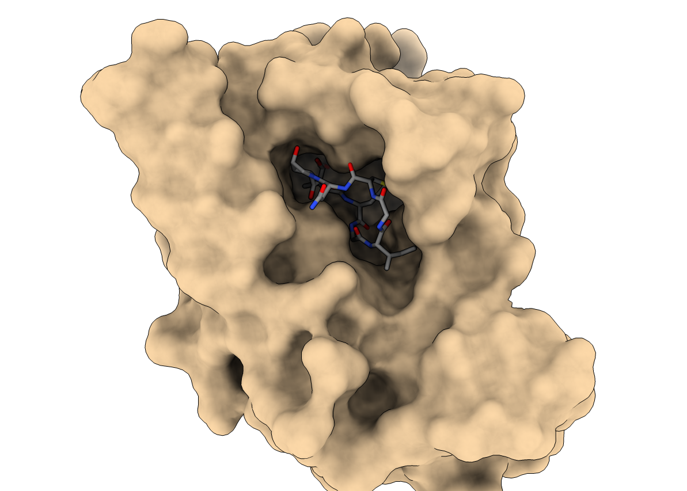

# AI-based-Protein-design-resources

**This** is a list of resources from iGEM Team Hamburg 2025

> Team [Hamburg Wiki](https://2025.igem.wiki/hamburg/)  
> iGEM [Website](https://igem.org/)

---

  

##  This includes  
- Articles
- Reviews
- Preprints
- Videos
- Channels
- Repositories
- Websites
- Notebooks
- Onlibe Resources
- Services
